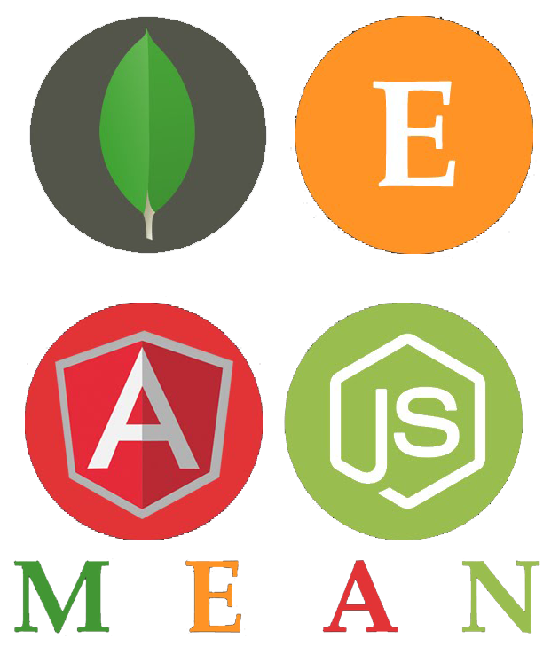

## Angular project for SoftUni Angular course

### https://find-vacation.herokuapp.com

## Technologies used:
* MongoDB + Mongoose
* Express
* Angular
* Node.js
* HTML & CSS
* [Cloudinary](https://cloudinary.com/) for image storage

  
    

## Functionality
* Guests can see countries, offers in every country, offers catalog, agency profiles
* Logged Users can book for offer, cancel booking, add comments to offers, add offers to favourites, remove from favourites, profile page and edit profile
* Logged Agency accounts have access to create offers page, delete their own offers, profile page and edit profile

## Test
### Client:
* cd vacation-app
* npm install
* ng serve for a dev server. Navigate to http://localhost:4200/. The app will automatically reload if you change any of the source files.

### Server:
* cd Rest-Api
* npm install
* npm run dev

### DB:
* You can add [MockData](MockData) to you local MongoDB

